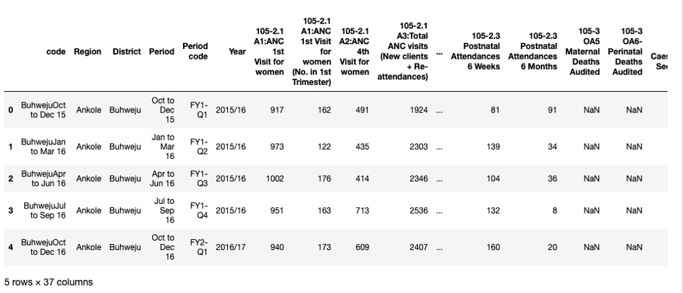
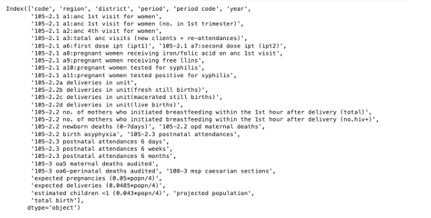

# Data Processing of RMNCH DATA
Refining Reproductive, Maternal, Newborn, and Child Health (RMNCH) Data: Cleaning and Preprocessing for Accurate Maternal and Child Health Insights
## Objective:
This project aimed to enhance the accuracy, usability, and reliability of Reproductive, Maternal, Newborn, and Child Health (RMNCH) data. The primary goal was to transform raw, inconsistent data into a clean, structured format, enabling accurate analysis and actionable insights for program evaluation and decision-making.
## Key Tasks and Processes:
- Handled missing values: Identified columns with missing data to ensure completeness during analysis, and filled missing values with zeros to maintain dataset consistency and avoid errors.
- Removed duplicate records: Detected and removed duplicate rows to ensure unique and accurate data entries
- Standardized column names: Stripped leading/trailing whitespace and converted column names to lowercase for consistency and
ease of use
## Outcome:
These data cleaning steps ensured that the dataset was well structured, with no missing values or duplicates, and that the column names were standardized. This provided a clean dataset for the next stages of analysis.
## Tools and technologies used:
- Python: Utilized Pandas for data manipulation and cleaning
- Jupyter Notebook: Documented and visualized the entire workflow for reproducibility
## Python Code and Results:
Below was the Python Code used to for data cleaning and the output of the results:
```python
# Import pandas to handle the data
import pandas as pd
# Load the dataset
file_path = '/Users/mac/Desktop/RMNCH_Data.xlsx'
df = pd.read_excel(file_path)
# Display the first few rows of the dataset
df.head()
```
---

## Data Analysis Results


## Data Cleaning
Data cleaning was an essential step to ensure the dataset was accurate, consistent, and ready for analysis. This process involved identifying and resolving issues such as missing values, duplicates, and inconsistent coulmn names.

The following tasks were performed:

- Checked for Missing Values: Identified columns with missing data to ensure that no essential information was omitted during analysis.
- Handled Missing Values: Filled missing values with zeros to ensure consistency in the dataset and avoid errors during analysis.
- Checked for Duplicate Rows: Checked for any duplicate rows and removed them to ensure that the dataset only contained unique records.
- Removed Duplicates: Removed duplicate entries that could potentially skew the analysis results.
- Standardized Column Names: Stripped any leading or trailing whitespace and converted all column names to lowercase for consistency.

These data cleaning steps ensured that the dataset was well structured, with no missing values or duplicates, and that the column names were standardized. This provided a clean dataset for the next stages of analysis.

The following Python code was used to carry out these tasks:
```python
# Check for missing values
df.isnull().sum()
# Fill missing values with zero
df_filled_zero = df.fillna(0)
# Check for duplicate rows
df.duplicated().sum()
# Remove duplicates
df_cleaned = df.drop_duplicates()
# Strip whitespace and standardize column names
df.columns = df.columns.str.strip().str.lower()
# Print the updated column names
df.columns
```

